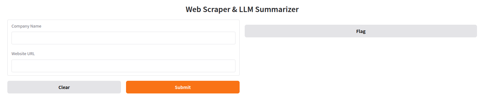
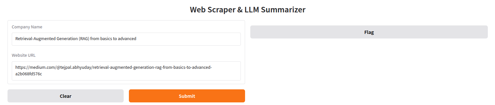
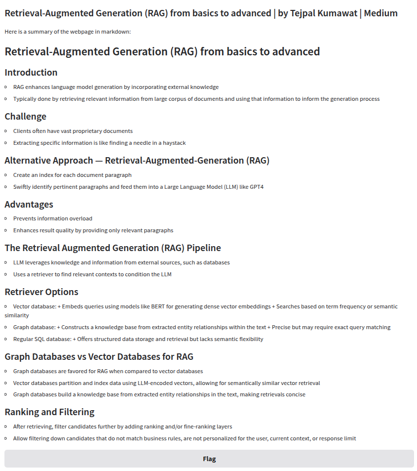

# 🕸️ WebScraper + LLM Summarizer using Ollama and Gradio

This project scrapes any public website and uses a local Large Language Model (LLM) via [Ollama](https://ollama.com/) to summarize its contents in a clean Markdown format. It's built with Python, BeautifulSoup, and Gradio for an interactive UI.

---

## 🚀 Features

- Scrapes website content using BeautifulSoup
- Generates intelligent summaries via local LLM (LLaMA3) using Ollama
- User friendly UI using Gradio
- Fully local, no API keys or external servers required

---
## ✍️ Example Use Case
Enter a company name and its website URL.

The app will:

Scrape the text content
Generate a markdown summary using LLaMA3
Show it in the browser

---

## 🧰 Tech Stack
Python
BeautifulSoup — HTML parsing
Gradio — UI framework
Ollama — Run LLaMA3 locally

---

## 🔍 Project Screenshot

Here's how the app looks:

